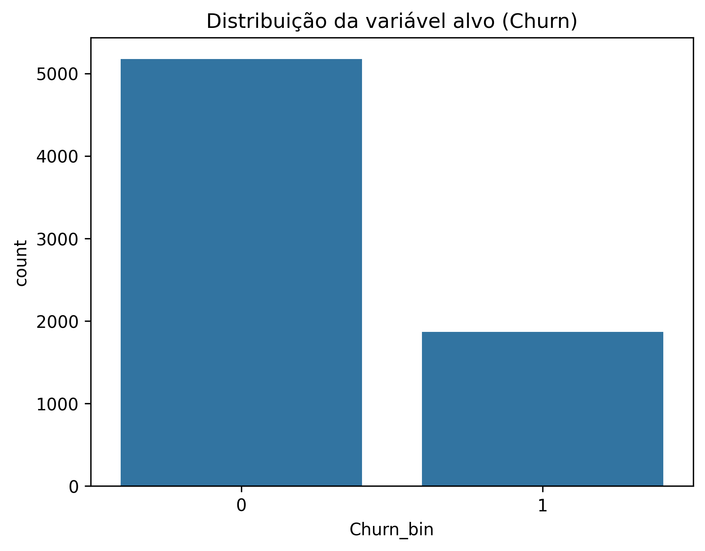
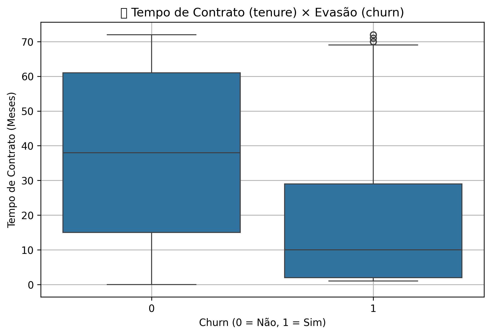
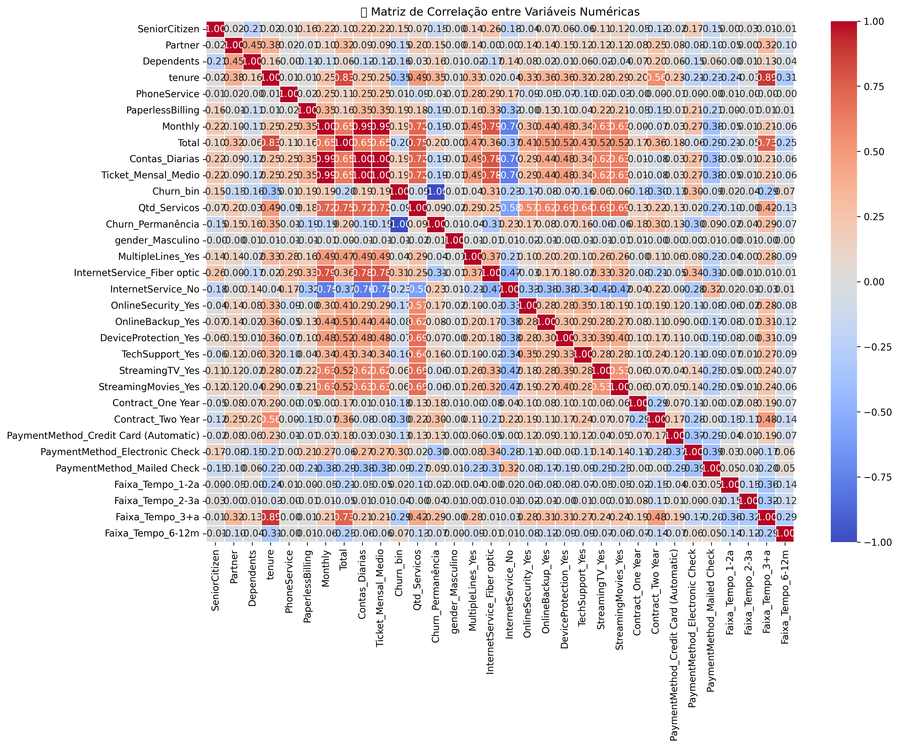
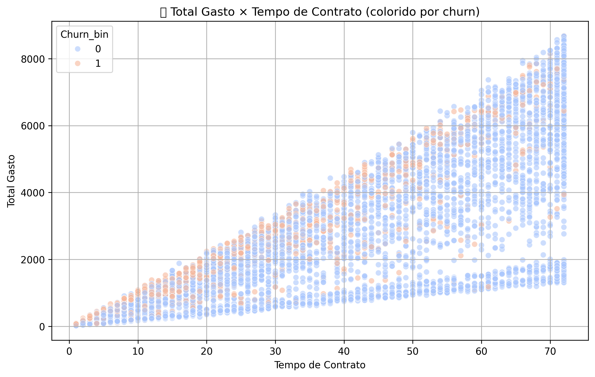
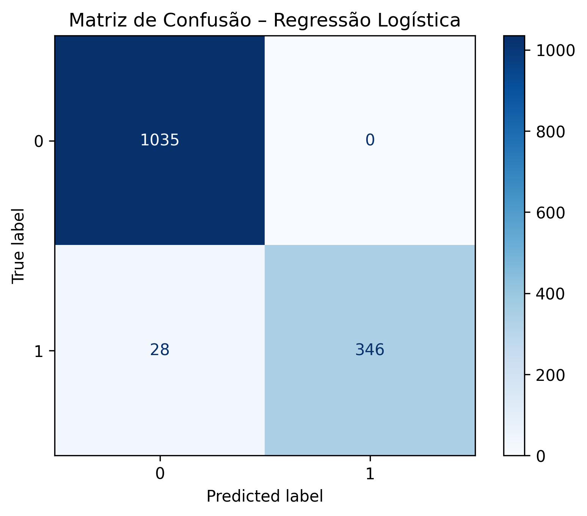
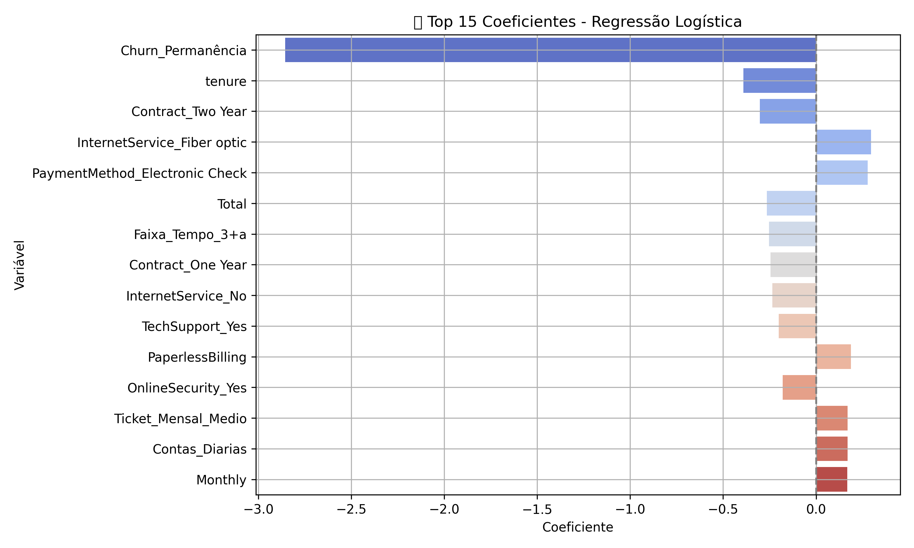
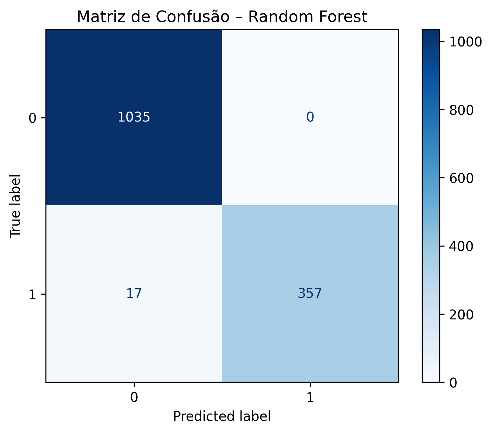
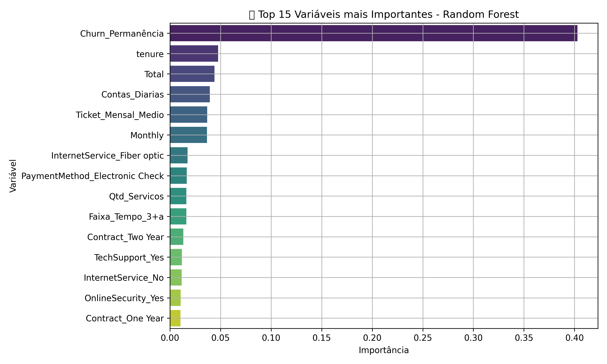

# 📊 Relatório Final – Análise de Fatores de Evasão de Clientes 

## 1. 🎯 Objetivo
Este relatório visa identificar os principais fatores que contribuem para a **evasão de clientes (churn)** em uma empresa de telecomunicações, utilizando análise exploratória de dados, modelagem preditiva e interpretação dos modelos de machine learning aplicados.

---

## 2. 📈 Análise Exploratória de Dados (EDA)

### 🔸 Distribuição da Evasão (`churn`)
A distribuição mostra que existe **desbalanceamento** entre clientes que permaneceram e os que cancelaram o serviço.

### 🔸 Relação entre Tempo de Contrato e Churn
Clientes com menor tempo de contrato tendem a evadir mais.

### 🔸 Correlação entre Variáveis
Observa-se correlação relevante entre `TotalGasto`, `MonthlyCharges` e `tenure`.

### 🔸 Total Gasto × Tempo de Contrato × Churn
Clientes com **baixo tempo de contrato e alto gasto total** têm maior propensão à evasão.

---

## 3. 🤖 Modelagem Preditiva

### 🔹 Modelo 1: Regressão Logística (com normalização)
- **Acurácia:** 98.01%
- **Precisão:** 100%
- **Recall:** 92.51%
- **F1-score:** 96.11%

### 🔹 Modelo 2: Random Forest (sem normalização)
- **Acurácia:** 98.79%
- **Precisão:** 100%
- **Recall:** 95.45%
- **F1-score:** 97.67%

---

## 4. 🔍 Principais Fatores de Evasão

Com base nas análises dos dois modelos, destacam-se como mais influentes:

- **Tempo de Contrato (`tenure`)**: quanto menor o tempo, maior o risco de evasão.
- **Tipo de Contrato**: contratos mensais apresentam maior probabilidade de churn.
- **Forma de Pagamento**: pagamentos com boleto ou sem débito automático têm mais evasões.
- **Cobranças adicionais**: clientes com serviços adicionais pagos (como segurança online ou backup) demonstram maior insatisfação.
- **Suporte Técnico e Atendimento**: variáveis relacionadas a atendimento ao cliente também apareceram como relevantes.

---

## 5. 📌 Conclusões e Estratégias de Retenção

### ✅ Conclusões:
- **Tempo de fidelização** é um dos fatores-chave.
- **Contratos mensais e formas de pagamento manuais** contribuem para a evasão.
- **Clientes com muitos serviços opcionais pagos** podem se sentir sobrecarregados financeiramente.

### 💡 Estratégias Sugeridas:
1. **Oferecer vantagens para contratos anuais** (ex: descontos progressivos).
2. **Incentivar débito automático** com bonificações.
3. **Monitorar usuários com múltiplos serviços** e oferecer pacotes personalizados com custo reduzido.
4. **Melhorar atendimento e suporte técnico**, focando em clientes que já demonstram sinais de churn.
5. **Campanhas específicas** para clientes com baixo tempo de contrato.

---
